# CAN-TMM88D Sensor Monitoring with TDC-X

Real-time inclination sensor data monitoring system using TMM88D-PCI090 sensor and TDC-X device. Features CAN interface communication, data processing with Go, SQLite storage, and Grafana visualization.

## Overview
This application creates a complete monitoring pipeline for industrial inclination sensor data:

- Real-time data collection from TMM88D-PCI090 sensor (X and Y inclination angles)
- CAN interface communication via TDC-X device
- Data processing with Go application
- Time-series storage in SQLite database
- Real-time visualization in Grafana

## System Architecture
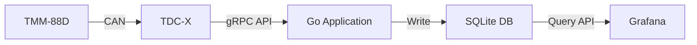

## Contents

1. [Overview](#overview)
2. [System Architecture](#system-architecture)
3. [System Requirements](#system-requirements)
    - [Hardware Requirements](#hardware)
    - [Software Requirements](#software)
4. [TDC-X Network Configuration](#tdc-x-network-configuration)
5. [Quick Start](#quick-start)
6. [TMM88D Sensor Setup](#tmm88d-sensor-setup)
    - [Information](#information)
    - [Key Features](#key-features)
    - [CANopen State Machine](#canopen-state-machine)
    - [Network Management Services](#network-management-services)
7. [CAN Interface](#can-interface)
    - [Service Data Objects (SDO)](#service-data-objects-sdo)
    - [Process Data Objects (PDO)](#process-data-objects-pdo)
8. [Application Setup](#application-setup)
    - [Application Overview](#application-overview)
    - [Go Application](#go-application)
    - [Building and Deployment](#building-and-deployment)
9. [Grafana Setup](#grafana-setup)
    - [SQLite Datasource Setup](#sqlite-datasource-setup)
    - [Grafana Dashboard Setup](#grafana-dashboard-setup)
10. [Troubleshooting](#troubleshooting)

## System Requirements

### Hardware:
- TMM88D-PCI090 inclination sensor
- TDC-X device, firmware version: 1.2.0 or higher
- Network connection

### Software:
- Go programming environment (for building the application)
- Docker (for containerization)
- Grafana (port 3001)
- SQLite database

## TDC-X Network Configuration
- IP Address: ```192.168.0.100```
- Web Interface Port: ```80```

## Quick Start
1. Build the Go application for CAN communication
2. Create Docker image and save it
3. Upload Docker image to TDC-X via Portainer
4. Deploy the stack with docker-compose
5. Configure Grafana data source and dashboard
6. Monitor sensor values in real-time


## TDC-X CAN Interface 
TDC-X features one CAN interface. CAN interface on TDC-X is designed to work with HAL Service gRPC API, so to understand how this works, refer to official instructions found here:
* [gRPC Usage](https://github.com/SICKAG/sick_tdc-x-developers-documentation/wiki/Getting-Started#grpc-usage) 
* [CAN Examples](https://github.com/SICKAG/sick_tdc-x-developers-documentation/wiki/Code-Samples#controller-area-network-examples)

### Information

The TMM88D is a 2-dimensional inclination sensor with CANopen interface. It is used to measure inclinations in 2 ±90° ranges (X/Y) with high accuracy. More information about the sensor can be found in the official documentation.

### Key Features

* 2-dimensional inclination measurement
* Measuring range: ±90° (X/Y)
* High resolution (0.01°)
* High accuracy (up to 0.3° typical)
* CANopen interface
* Operating temperature: -40°C to +80°C
* Enclosure rating: IP67/69


### CANopen State Machine

The inclination sensor features a CANopen state machine with the following states:

- **Initializing**: Device application and communication initialization
- **Pre-Operational**: Ready for configuration via SDO, but no PDO communication
- **Operational**: Fully operational, can transmit PDOs and emergency messages
- **Stopped**: No active communication (though monitoring via node guarding continues)


### Network Management Services

Network management (NMT) services are used to switch between the individual statuses of the CANopen state machine. The NMT telegrams for device monitoring use the COB ID 0 and have the highest priority.

### Service Data Objects (SDO)

Service data objects (SDO) form the communication channel through which device parameters are transmitted. They are used for status queries and configuration. The inclination sensor functions as an SDO server in the client-server model.

### Process Data Objects (PDO)

Process data objects (PDO) are used for rapid and efficient data exchange of real-time data (e.g., inclination angles). PDOs are transmitted without confirmation. The inclination sensor supports one or two (TMS/TMM88D) transmit PDOs.

---
## Application Setup

> _NOTE:_ For application building and deployment, go to [this part](#building-and-deployment) of instructions.

### Application Overview

The monitoring system consists of the following components:

1. **Go Application**
    - CAN interface communication
    - Data processing and formatting
    - SQLite database storage
2. **SQLite Database**
    - Time-series storage for sensor data
    - Lightweight embedded database
3. **Grafana** (port 3001)
    - Advanced data visualization
    - Real-time monitoring dashboards
    - SQLite data source integration


## Example In Go Language

In the shown example, package [canbus](https://pkg.go.dev/github.com/go-daq/canbus@v0.2.0) will be used. Canbus provides high-level facilities to interact with CAN sockets.

Full example code can be found in the subdirectory, only key parts of the program will be explained.

### gRPC

To operate with CAN interface on TDC-X we had to access HAL Service gRPC api. For more informations how this works, please look [here](https://github.com/SICKAG/sick_tdc-x-developers-documentation/wiki/Getting-Started#grpc-usage).


#### Protoc Files
Project already includes generated protoc files, so nothing should be generated, program is ready to be built. In case you want to generate files for the gRPC service you can use command :
```
buf generate pkg/
```

### Setting up CAN interface
```go
func setupCan() {
    // Create new CAN bus device socket
    canBus, err = canbus.New()
    if err != nil {
        log.Fatalf("Failed to open CAN bus: %v", err)
    }

    // Binds can0 to the socket 
    err = canBus.Bind("can0")
    if err != nil {
        log.Fatalf("Failed to bind CAN socket to interface: %v", err)
    }
    
    sendCanMsg(canBus)
}
```

The `setupCan()` function initializes the CAN bus interface and binds it to can0. This is required before any CAN communication can take place.

#### Reading sensor values
```go 
// Inside main() loop
frame, err := canBus.Recv()
if err != nil {
    log.Fatalf("Can not recv frame: %+v", err)
}

if len(frame.Data) < 4 {
    fmt.Printf("Not enough bytes")
    continue
}

// parsing sensor values (big-endian)
x := int16(frame.Data[1])<<8 | int16(frame.Data[0])
y := int16(frame.Data[3])<<8 | int16(frame.Data[2])

// applying resolution scaling
		const resolution = 100.0
		x = x / resolution
		y = y / resolution
```

The main loop continuously reads CAN frames and processes them:

1. Receives raw CAN frame data
2. Checks for minimum data length (4 bytes needed)
3. Converts bytes to X/Y coordinates using big-endian format
4. Applies resolution scaling (0.01 degrees)

#### Configuring The Sensor
```go
func sendCanMsg(canBus *canbus.Socket) {
    // Array of configuration messages
    var msg [7]canbus.Frame
    
    // Enter Pre-Op mode
    msg[0] = canbus.Frame{
        ID:   0x000,
        Data: []byte{0x80, 0x0a},
    }
    
    // Configure PDO parameters
    msg[1] = canbus.Frame{
        ID:   0x60a,
        Data: []byte{0x2f, 0x00, 0x18, 0x02, 0xff, 0x00, 0x00, 0x00},
    }
    // ... additional configuration messages ...
    
    // Enter Operational mode
    msg[6] = canbus.Frame{
        ID:   0x000,
        Data: []byte{0x01, 0x0a},
    }
    
    // Send all configuration messages
    for i := 0; i < len(msg); i++ {
        canBus.Send(msg[i])
    }
}
```

The `sendCanMsg()` function configures the sensor by sending a sequence of CAN messages that:

1. Put the sensor in Pre-Operational mode
2. Configure PDO parameters
3. Save settings
4. Put the sensor in Operational mode to begin sending data

### Building and Deployment

Dockerfile has two separate stages: one for building a binary, and another wherey the binary gets copied from the first stage into the next stage.

To build and deploy the application:

1. Build Docker image:

```
docker build --build-arg BUILDER_STAGE_IMAGE=golang:latest --platform linux/arm64 -t can_app .
```

2. Save Docker image:
```
docker save -o can-app.tar can_app
```

### Uploading application to TDC-X

Portainer will be used to upload our application, make sure you have it installed, for more informations please visit [this](https://github.com/SICKAG/sick_tdc-x-developers-documentation/wiki/Getting-Started#installing-accessing-and-removing-applications) documentation.

#### Docker image upload
* Go to Images

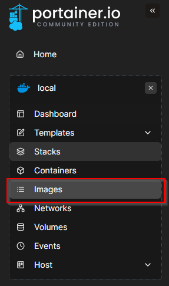

* Click import 

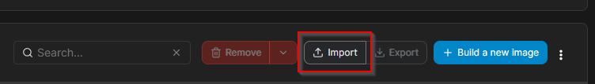

* Click Select file

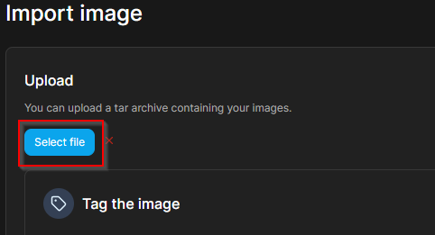

* You can choose a pre-built docker image file available [here](/can-app.tar), or your own built image using this documentation.

#### Docker stack upload

* Go to Stacks 
    
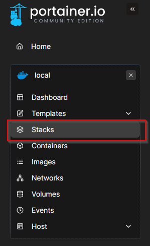

* Click add stack
    
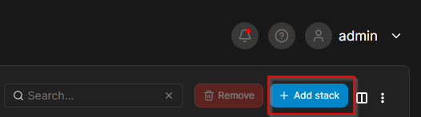

* Give stack a name, e.g. ```tmm-sql-grafana```.

* Inside Web editor paste docker-compose code found [here](/docker-compose.yml), **do not** deploy the stack yet.

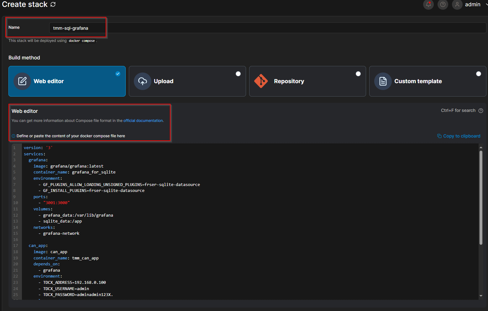

* Change environment variables
    * **TDCX_ADDRESS=**```<TDC-X-ip-address>```
    * **TDCX_USERNAME=**```<TDC-X-username>```
    * **TDCX_PASSWORD=**```<TDC-X-password>```
> _NOTE:_ This part if important because app needs to know your credentials.

* Deploy the stack

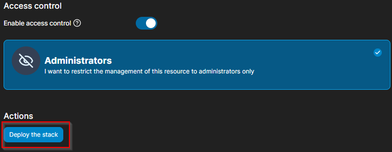

This will start CAN-TMM88D application with grafana application running on port ```3001```. Additionally, sqlite plugin will be installed.


## Grafana Setup

### SQLite Datasource Setup

Grafana used in this example is not installed from TDC-X applications section, but we rather installed it through docker-compose. For that reason we mapped its UI from ```3000``` to ```3001```.


1. Open Grafana UI on port ```3001``` ([here](http://192.168.0.100:3001/))

2. Configure login process

3. Go to Connections and click Data sources

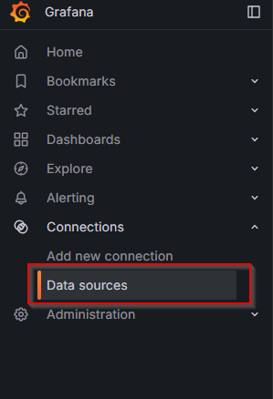

4. Click add new data source 

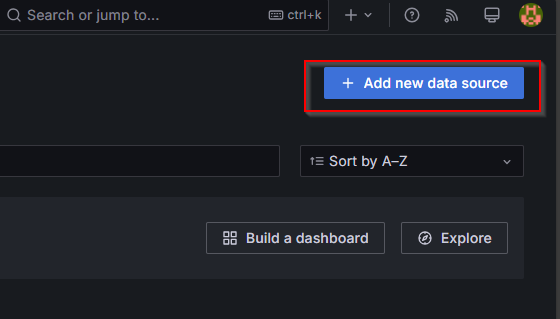

5. Find SQLite and click on it

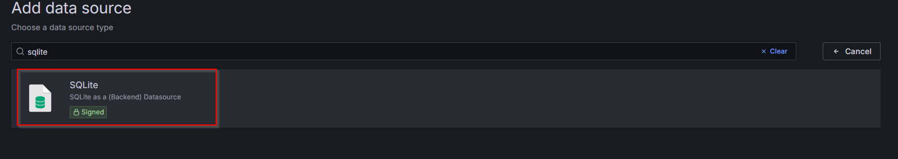

### SQLite Datasource Setup

1. Name: **SQLite Database**
2. Path: **/app/sqlite-database.db**

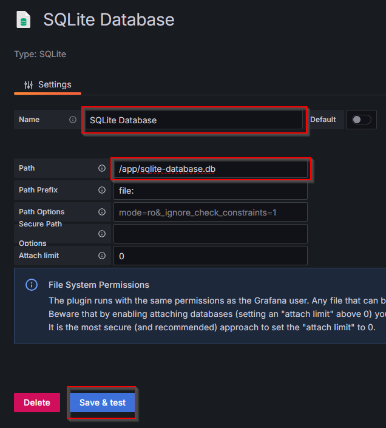

If everything is correct, after clicking save and test button, green popup should look like image down below.

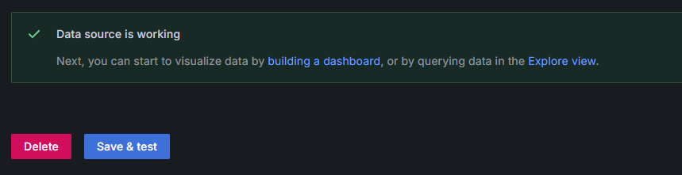

### Grafana Dashboard Setup

* Go to Dashboards 

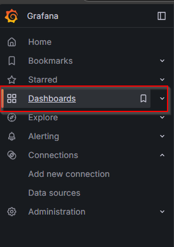

* Click **New** on the right side
* Click **Import**

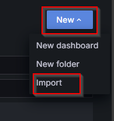

* Paste JSON configuration available [here](grafana/grafana-dashboard.json)

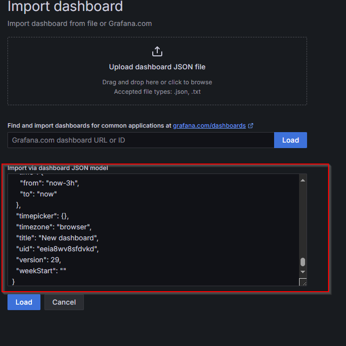

* Open imported dashboard and press refresh button

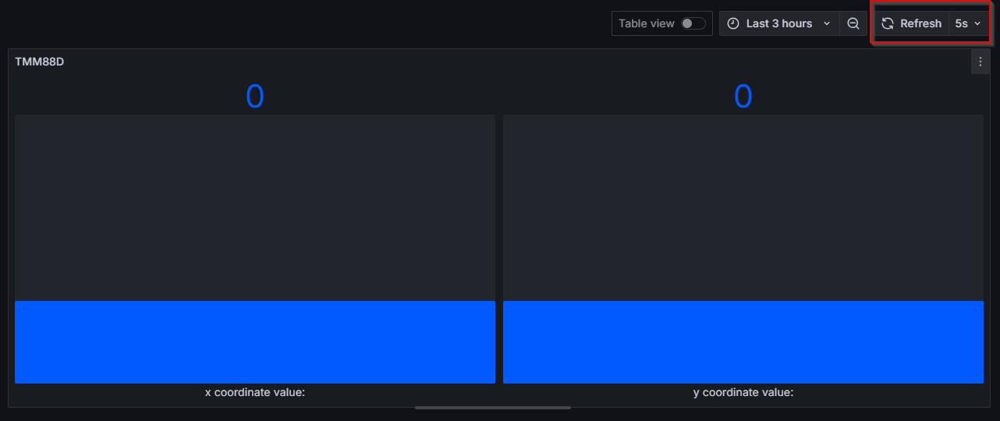

Now you can monitor your sensor values with Grafana UI. Try moving around your sensor to see how values change.

## Troubleshoot

Common issues and solutions:

- **No Data in Grafana**: Verify SQLite data source configuration and query syntax

* Edit panel configuration

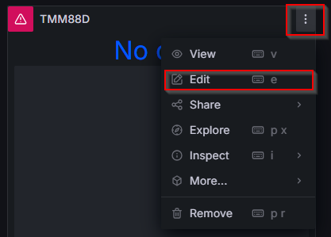

* Under queries section, select correct data source, previously created

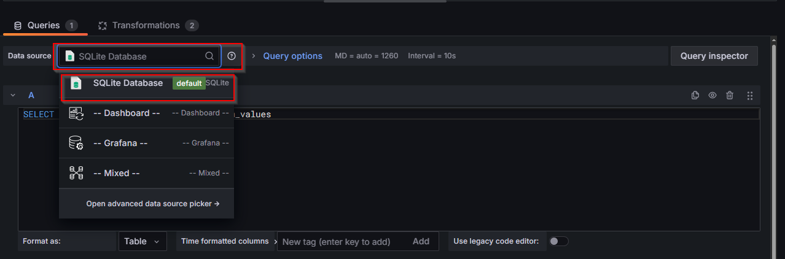

* SQL QUERY: 
```
SELECT outputx,outputy,timestamp from tmm_values
```
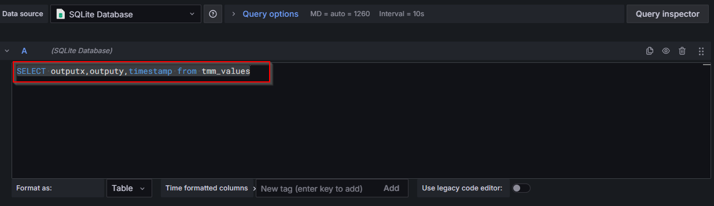

* Transformations:

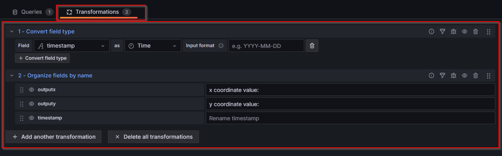