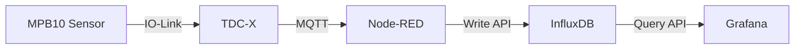

# Flow-based Monitoring with TDC-X

Real-time sensor data monitoring system using MPB10 Multi Physics Box sensor and TDC-X device. Features flow-based architecture with Node-RED, MQTT, InfluxDB and Grafana.

## Overview

This application creates a complete monitoring pipeline for industrial sensor data:
- Real-time data collection from MPB10 sensor (vibration, shock, temperature)
- IO-Link communication via TDC-X device
- MQTT messaging for data transmission
- Data processing with Node-RED
- Time-series storage in InfluxDB 
- Real-time visualization in Grafana

## System Architecture


## Contents

1. [Overview](#overview)
2. [System Architecture](#system-architecture)
3. [System Requirements](#system-requirements)
   - [Hardware Requirements](#hardware)
   - [Software Requirements](#software)
4. [TDC-X Network Configuration](#tdc-x-network-configuration)
5. [Quick Start](#quick-start)
6. [MPB10 Sensor Setup](#mpb10-sensor-setup)
   - [Information](#information)
   - [Key Features](#key-features)
   - [Connect MPB10 to TDC-X](#connect-mpb10-to-tdc-x)
   - [IODD File](#iodd-file)
   - [IODD File Upload on TDC-X](#iodd-file-upload-on-tdc-x)
7. [MQTT Setup](#mqtt-setup)
   - [MQTT Configuration Fields](#mqtt-configuration-fields)
   - [Last Will Settings](#last-will-settings)
   - [MQTT Status](#mqtt-status)
   - [Send IO-Link Data To Broker](#send-io-link-data-to-broker)
   - [MQTT Topics](#mqtt-topics)
8. [Application Setup](#application-setup)
   - [Application Overview](#application-overview)
   - [Application Installation](#application-installation)
   - [Installation Verification](#installation-verification)
9. [InfluxDB Configuration](#influxdb)
10. [Node-RED Configuration](#node-red)
11. [InfluxDB Dashboard Configuration](#influxdb-dashboard-configuration)
12. [Grafana Setup](#grafana)
12. [Troubleshooting](#troubleshooting)


## System Requirements

### Hardware:
- MPB10 Multi Physics Box sensor
- TDC-X device, firmware version: 1.2.0 or higher
- Network connection

### Software:
- Node-RED (port 1880)
- InfluxDB (port 8086) 
- Grafana (port 3000)
- Mosquitto MQTT broker

## Troubleshooting

Common issues and solutions:

- **MQTT Connection Failed**: Verify Mosquitto broker is running and credentials are correct
- **InfluxDB Write Errors**: Check API token permissions and bucket exists
- **No Data in Grafana**: Verify InfluxDB data source configuration and query syntax
- **Missing Sensor Data**: Check IO-Link connection and MQTT topic configuration

## TDC-X Network Configuration
- IP Address: ```192.168.0.100```
- Web Interface Port: ```80```
- Subnet Mask: ```255.255.255.0```

## Quick Start
1. Install required applications on TDC-X (Node-RED, InfluxDB, Grafana, Mosquitto)
2. Configure MPB10 sensor and IO-Link connection
3. Set up MQTT messaging
4. Import Node-RED flows
5. Configure InfluxDB storage
6. Import Grafana dashboards


## Applications

This section covers the installation of all required applications for the monitoring system. Make sure you have the following applications installed and running:

### Application Overview
1. **Node-RED** (port 1880)
   - Data flow orchestration and processing
   - MQTT subscriber and publisher
   - Data transformation for InfluxDB

2. **InfluxDB** (port 8086)
   - Time-series database for sensor data storage
   - API endpoint for data ingestion
   - Built-in dashboard capabilities

3. **Grafana** (port 3000)
   - Advanced data visualization
   - Real-time monitoring dashboards
   - Multi-source data integration

4. **Mosquitto** (port 1883)
   - MQTT message broker
   - Handles pub/sub communication
   - Connects TDC-X to Node-RED


### Application Installation
To install the apps, simply aim to applications tab to find list of applications. Next to application needed, **install** button can be found.

_**NOTE:** To install the listed applications, make sure the TDC-X device is connected to a network._

## MPB10 Sensor Setup

This section covers the configuration and setup of the MPB10 Multi Physics Box sensor with the TDC-X device.

### Information
The Multi Physics Box MPB10 is a condition monitoring sensor. It is used to detect ambient and/or status conditions of a machine or system, such as vibration, shock and temperature. More information about the sensor you can find [here](https://www.sick.com/be/en/catalog/products/detection-sensors/condition-monitoring-sensors/multi-physics-box/mpb10-vs00vsiq00/p/p670770).

### Key Features
* Vibration monitoring up to 6 kHz
* Temperature measurement range: -40°C to +85°C  
* 3-axis acceleration measurement
* IO-Link communication interface
* Compact and robust industrial design

### Connect MPB10 to TDC-X
Make sure that sensor is plugged to your TDC-X device, which has multiple interfaces for IO-Link devices, we are assuming that you connected it to port 1. Now if you click [this](http://192.168.0.100/#/io-link/devices/1) link you should be able to see device that is connected to your TDC-X.

### IODD file
IODD XML file is describing how IO-Link devices communicate information to higher level systems or controllers. For needed .xml file use IODD finder to download it [here](https://ioddfinder.io-link.com/productvariants/search/42370). 

### IODD file upload on TDC-X

Go to IO-Link tab and open IODD File Management, you can find it [here](http://192.168.0.100/#/io-link/iodd-file-management). Simply click upload and choose the file you need.


This is how your screen should look like after uploading the file correctly.

_**NOTE:** To download the file, make sure you read [this](#iodd-file) section._

Now if you head back to IO-Link tab ([link](http://192.168.0.100/#/io-link/devices/1)) and click IODD view, much more detailed and profiled data will be shown.


This is how screen should look like after clicking IODD view.

## MQTT Setup

**NOTE:** Before working with MQTT make sure you have ```Mosquitto``` application installed.

Go to IO-Link tab and find MQTT settings ([link](http://192.168.0.100/#/io-link/MQTT-settings)) and under MQTT configuration section set Client mode active ```true``` and fill required fields.

### MQTT configuration fields:
* **Server IP:** 192.168.0.100

_**NOTE:** For this project we use mosquitto broker on TDC-X, so **Server IP** is TDC-X IP address._
* **Port:** 1883
* **Username:** admin
* **Password:** password

**NOTE:**  Default configuration of internal broker does not require ```Username``` and ```Password```.
* **Keep alive time:** 60


### Last Will Settings:
* **Topic:** lastWillTopic
* **Message:** last will message
* **QoS:** Only Once
* **Retain:** false


### MQTT Status:
If everything is set up correctly under MQTT status connection, once settings are applies, status connection should be accepted.


### Send IO-Link Data To Broker:
To send data from IO-Link device to broker we have to configure MQTT topics section in IO-Link tab ([link](http://192.168.0.100/#/io-link/MQTT-settings)). 

### MQTT Topics:
Press **Add topic** button and fill required fields
* **Port:** Port 1
* **QoS:** Only Once
* **Type:** Process data
* **Direction:** Get data
* **Format:** Iodd data
* **Interval:** Interval
* **Cycle time:** 1000
* **Topic name:** master1port1/processData

If everything is set up correctly under MQTT topics you should see this.


## Application setup

This section covers the setup and configuration of all required applications for the monitoring system. Make sure you have the following applications installed and running:

#### Installation Verification
Before proceeding with configuration, verify that:
- All applications are installed on TDC-X
- Required ports are accessible
- Applications show "Running" status in TDC-X interface
- Network connectivity is established

For detailed installation instructions, refer to the [Application Installation Guide](#application-installation).


### InfluxDB 

InfluxDB is the time series data platform designed to handle high write and query workloads.
Make sure to install it using ```Applications``` tab, after that you can access its UI on port ```8086``` 

#### Configuration


Picture shows how the Initial User is configured for this example.

Enter preferred username, password, organization name and bucket name. ```Bucket``` is where your time series data is stored with a retention policy.

_**NOTE:** **READ THIS PART.**_
```Initial Organisation Name``` and ```Initial Bucket Name``` will be needed for **Node-Red** part, so please paste it in text editor like Notepad++.

After initial user setup ```API token``` will be shown. This part is really important because you won't be able to see token after you continue, so copy the token and save it somewhere local in Notepad++ or any other text processor you use. 

### Node-Red 
Low-code programming for event-driven applications.
Make sure to install it using ```Applications``` tab, after that you can access its UI on port ```1880``` 

#### Configuration
This section will explain how to setup and configure node-red.

##### Flow import 

* Find and click on burger bar (top right corner). 


* Click import.


* Paste the JSON configuration available [here](/application-examples/Flow-Based-Monitoring/src/nodered_flow.json) and click import.


* Flow should be present as on picture


##### Credentials

Make sure to insert credentials to authenticate for TDC-X API calls.

* Double-click on ```credentials```


* Change ```tdcx-username``` and ```tdcx-password``` to credentials used for your TDC-X device.


##### HTTP requests

TDC-X group is connecting to TDC-X REST API to authenticate and get TDC-X and MPB data. Device endpoints can be accessed [here](http://192.168.0.100/docs/control-center/).

**NOTE:** Follow steps below only if your IP address is not default (192.168.0.100)

* Open ```tdc-x stats endpoint``` node.


* Change IP address that suits device.


* Open ```tdc-x auth endpoint``` node.


* Again change IP address that suits device.


* Open ```influxdb-write``` node.


* Change URL address based on your InfluxDB configuration, InfluxDB API is explained [here](#influxdb-endpoint)
   * **Change properties down below**
  * ```org=<organisation-name-from-InfluxDB>```
  * ```bucket=<bucket-name-from-InfluxDB>```


* Check ```Use authentication``` type is ```bearer``` and under ```token``` field insert your InfluxDB token.


###### InfluxDB endpoint

From official API [documentation](https://docs.influxdata.com/influxdb/v1/guides/write_data/) writing to a database using the InfluxDB 2.0 API (compatible with InfluxDB 1.8+) can be achieved by sending POST requests to the /api/v2/write endpoint:

```
curl -i -XPOST 'http://localhost:8086/api/v2/write?bucket=db/rp&precision=ns' \
  --header 'Authorization: Token username:password' \
  --data-raw 'cpu_load_short,host=server01,region=us-west value=0.64 1434055562000000000'
```

Endpoint URL should be:
```
http://{DEVICE_IP}:8086/api/v2/write?org=<influxdb organisation name>&bucket={<influxdb bucket name>}&precision=ms 
```

#### Start Application

To start node-red flow press red ```Deploy``` button on top right side of the screen.

#### JSON structure. 
This section shows parsed data that flows to InfluxDB.

**TDC-X monitor data:**
```
{
  "measurement": "mpb",
  "tags": {
    "host": "server01",
    "region": "eu"
  },
  "fields": {
    "cpu_load": 0.72,
    "memory_used": 765.0,
    "temperature1": 43,
    "temperature2": 46.75
  }
}
```

**MPB sensor data:**
```
{
  "measurement": "mpb",
  "tags": {
    "host": "server01",
    "region": "eu"
  },
  "fields": {
    "value_x": 24,
    "value_y": 43,
    "value_z": 15
  }
}
```

### InfluxDB Dashboard configuration 

InfluxDB also offers very quick dashboard configurations. Access InfluxDB UI on port 8086, go to Dashboards tab ```Create Dashboard → Import Dashboard``` and simply upload or paste JSON code available [here](/application-examples/Flow-Based-Monitoring/src/influxdb_dashboard.json)


This is dashboard easily created for demonstrating purposes. Represents MPB10 values alongside with TDC-X monitoring data.


**NOTE:** Refreshing interval can be changed to 1s by clicking on refresh button and type the 1s value.

### Grafana 

Grafana Cloud is a highly available, fast, fully-managed OpenSaaS logging, metrics, traces, and profiling platform that also provides incident management and our application monitoring service.
Make sure to install it using ```Applications``` tab, after that you can access its UI on port ```3000``` 

#### Setup

To access data from influxd, ```data source``` has to be created. Go to ```connections``` and ```Data sources``` then choose ```InfluxDB``` as a source.

Look at the picture down below for guidance how to setup datasource.


##### Query language:
* Name: ```Flux```

##### HTTP:
* URL: ```192.168.0.100:8086``` (InfluxDB URL)
* Allowed Cookies: empty
* Timeout: ```-1```

##### Auth:
* Basic Auth: ```true```

##### Basic Auth Details:
* User: ```admin``` (InfluxDB username)
* Password: ```password``` (InfluxDB password)

##### InfluxDB Details:
* Organisation: ```SICK``` (InfluxDB organisation)
* Token: ```token``` (InfluxDB token)
* Default Bucket: ```data``` (InfluxDB bucket)

Press save and test button and you should get green notification if everything is set up correctly.

Created data source gives you many possibilities to create various dashboards and graphs in Grafana.  

#### Dashboard configuration

Dashboard created for this demonstration purposes shows MPB sensor data and TDC-X monitoring data.

Grafana dashboard import files are available [here](/application-examples/Flow-Based-Monitoring/src/grafana_dashboard.json). If you want to use them go to ```Dashboards → New → import``` then simply paste the JSON code or load the JSON file.

Dashboard should look like the image below after you press refresh button.


#### Dashboard Not Working

* Click on three dots over a graph

* Press ```Edit``` button


* Press ```Refresh``` button multiple times


This should do the trick.
